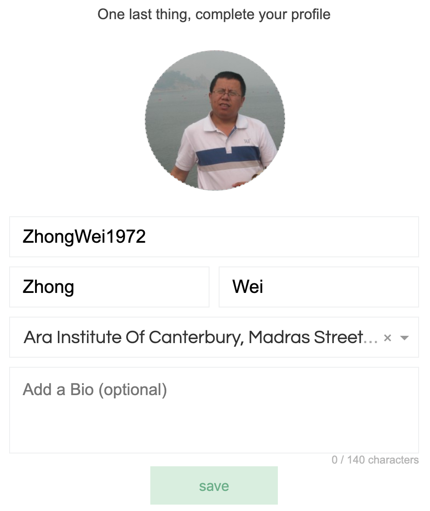

# 第 0 章 Be Ready!

本书使用的教学语言是 **Python3**，并且使用 ****[**repl.it**](http://repl.it) ****做为教学环境。使用 [repl.it](http://repl.it) 做为教学环境最大的好处是：无论身在何处使用何种电脑，只要电脑上有浏览器，能上网，你就能够随时可以学习。

为了保存你的学习成果，应该注册一个 repl.it 账号。 如果你有 Gmail 邮箱的话，注册过程是相当简单的。下面我简要说明以下如何使用 gmail 注册 repl.it

打开 repl.it 主页，点击页面右上角的 Login 而不是页面正当中的 Sign Up：

你会看到

不要输入东西，点击上面一排图标中最左边彩色的 G

如果是你自己的电脑，这时你的 Gmail 账号就会自动出现在第一个位置，点击它。如果它问你要密码，输入你的Gmail账号密码即可。然后进入最后一步：

选择一个你喜欢的用户名，如果愿意你还可以告诉它你的学校是哪个，写个个人简介。然后点击 Save 你会看到：

点 Quick Start Guide 可以看新手指南，点 Start coding now  开始 Coding （编程）。点 Start coding now，你会看到一个搜索框和一个语言列表：

我们要学习的 Python 语言在最前面，点击它，如果网速慢的话可能需要稍等一会，你会看到下面的界面。

右边的黑框框就是我们日常玩耍的地方，它是一个 playground，在这个区域你可以输入一些小块的代码用来做各种试验。好了。现在点一下右侧这个黑框框区域，让它获得焦点。

We're ready！

